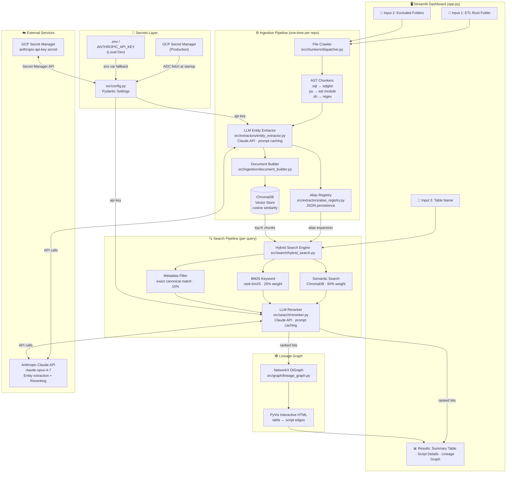
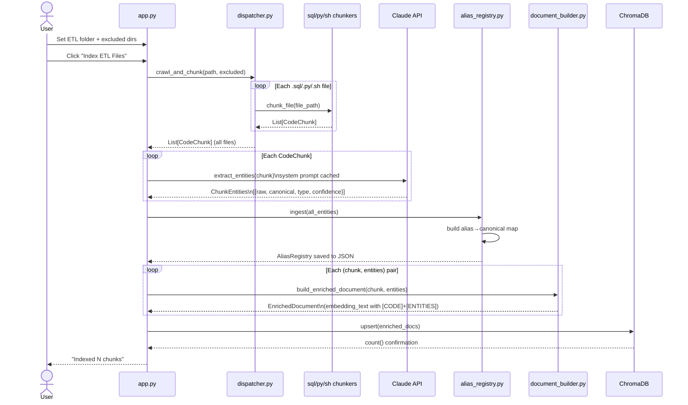
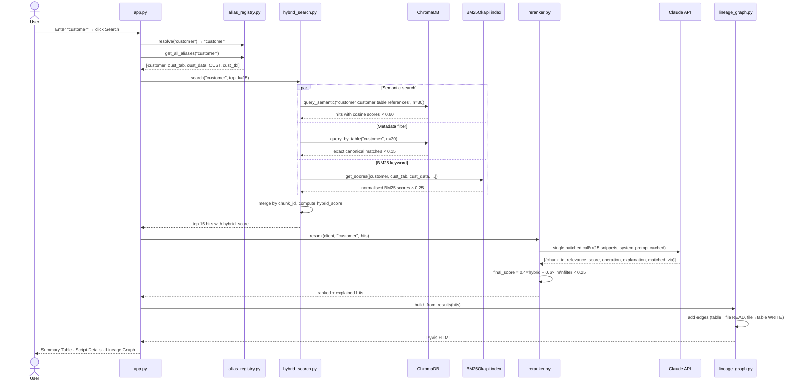
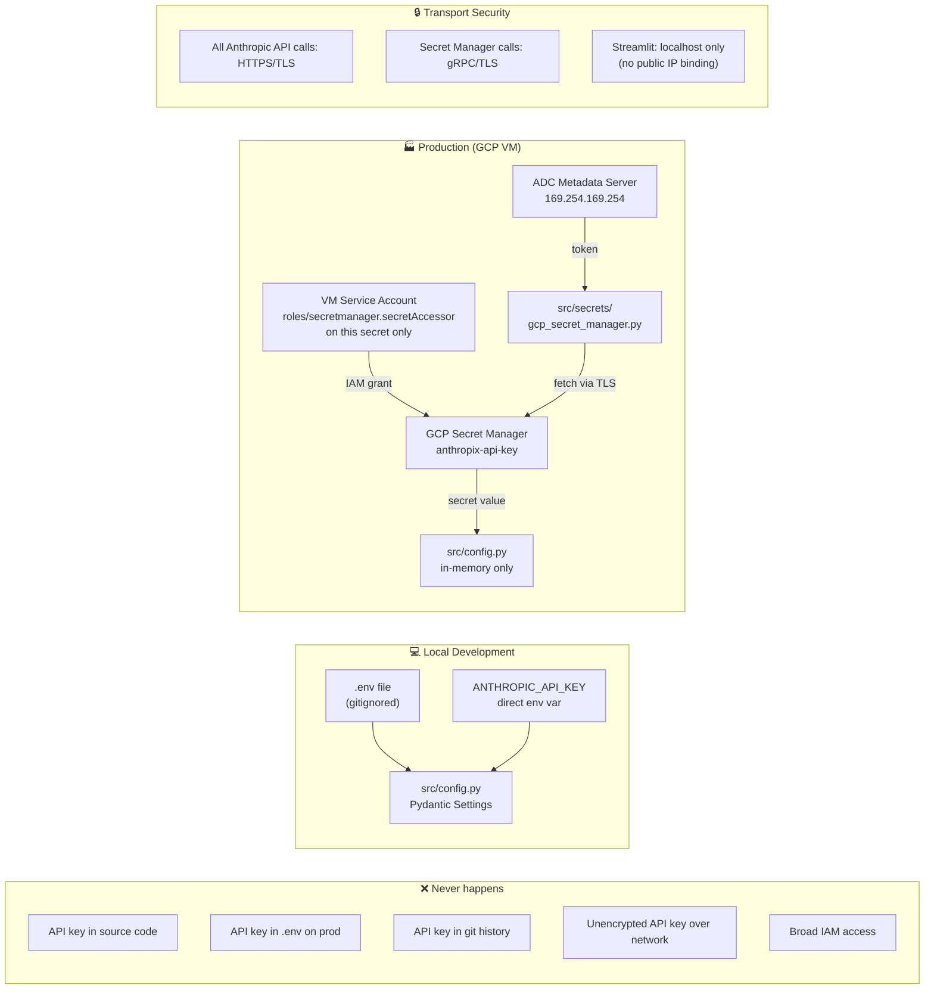

# Data Lineage Discovery Dashboard — Solution Architecture

**Version:** 1.0  
**Type:** Production Prototype  
**Stack:** Python 3.11 · Streamlit · ChromaDB · Anthropic Claude · GCP Secret Manager

---

## Table of Contents

1. [Executive Summary](#1-executive-summary)
2. [System Architecture Overview](#2-system-architecture-overview)
3. [Component Deep-Dive](#3-component-deep-dive)
4. [Data Flow Diagrams](#4-data-flow-diagrams)
5. [Security Architecture](#5-security-architecture)
6. [Infrastructure Requirements](#6-infrastructure-requirements)
7. [Deployment Guide](#7-deployment-guide)
8. [Configuration Reference](#8-configuration-reference)
9. [API & Interface Contracts](#9-api--interface-contracts)
10. [Performance Characteristics](#10-performance-characteristics)
11. [Known Limitations & Production Hardening Roadmap](#11-known-limitations--production-hardening-roadmap)

---

## 1. Executive Summary

The Data Lineage Discovery Dashboard is a RAG-powered (Retrieval-Augmented Generation) application that answers the question:

> *"Which ETL scripts reference table X — even when they call it by a different name?"*

A data analyst types a table name (e.g. `customer`). The system finds every `.py`, `.sql`, and `.sh` ETL file that touches that table — including files that use aliases like `cust_tab`, `cust_data`, or `CUST` — and explains what each script does to the table (READ, WRITE, CREATE).

**Key differentiator:** Most lineage tools do exact string matching. This system uses semantic chunking + LLM entity extraction + hybrid search + LLM reranking to resolve aliases automatically, with no manual alias mapping required.

---

## 2. System Architecture Overview



---

## 3. Component Deep-Dive

### 3.1 Secrets Layer — `src/secrets/` + `src/config.py`

**Purpose:** Resolve the Anthropic API key at startup without ever storing it in code or git.

**Resolution order:**
```
GCP_PROJECT_ID set in env?
  YES → call GCP Secret Manager via ADC → return secret value
  NO  → read ANTHROPIC_API_KEY from env/.env → return value
  NEITHER → raise ValueError (fail fast, clear message)
```

**Files:**

| File | Role |
|---|---|
| `src/secrets/gcp_secret_manager.py` | Thin wrapper around `google-cloud-secret-manager`. Calls `SecretManagerServiceClient().access_secret_version()`. Raises `RuntimeError` with full context on failure. |
| `src/config.py` | `pydantic-settings` `Settings` class. `@model_validator(mode="after")` triggers secret resolution on instantiation. Single `settings` singleton imported by all modules. |

**Authentication mechanism (production):**  
GCP Application Default Credentials (ADC). On a GCP VM with an attached service account, no credential file is needed — the metadata server provides tokens automatically. Locally, `gcloud auth application-default login` writes credentials to `~/.config/gcloud/application_default_credentials.json`.

---

### 3.2 File Crawler — `src/chunkers/dispatcher.py`

**Purpose:** Walk an ETL repository and split every file into logical code units.

**Entry point:** `crawl_and_chunk(repo_path, excluded_dirs=None) → List[CodeChunk]`

**Exclusion logic:**
```python
def _is_excluded(file_path, root, excluded_dirs):
    relative = file_path.relative_to(root)
    return any(part in excluded_dirs for part in relative.parts)
```
Matches directory names at any depth — e.g. `excluded_dirs=["archive"]` skips both `/repo/archive/load.sql` and `/repo/jobs/archive/old.py`.

**Supported file types:**

| Extension | Chunker | Strategy |
|---|---|---|
| `.sql` | `sql_chunker.py` | `sqlglot.parse()` → one chunk per SQL statement; classifies SELECT/INSERT/UPDATE/DELETE/MERGE/CREATE/DROP |
| `.py` | `python_chunker.py` | `ast.parse()` → one chunk per function/class/module preamble; 30-line block fallback on `SyntaxError` |
| `.sh` | `shell_chunker.py` | Regex splits at function definitions, `psql`/`bq`/`spark-submit` calls, `if`/`for`/`while` blocks, comment section headers |

**`CodeChunk` dataclass** (`src/chunkers/base.py`):
```
chunk_id    : str   # "{file_path}::{line_start}-{line_end}"
file_path   : str
file_type   : str   # "sql" | "python" | "shell"
chunk_type  : str   # "select" | "insert" | "function" | "class" | ...
raw_text    : str
line_start  : int
line_end    : int
metadata    : dict
```

---

### 3.3 LLM Entity Extractor — `src/extractors/entity_extractor.py`

**Purpose:** For each code chunk, ask Claude to identify every table/dataset reference and map it to its canonical name.

**Claude call parameters:**
- Model: `claude-opus-4-7` (configurable via `LLM_MODEL`)
- Max tokens: `1024` per chunk
- System prompt: cached with `"cache_control": {"type": "ephemeral"}` to reduce API cost across chunks
- Code truncated to `4000` chars per chunk to control token usage

**Output — `EntityRef`:**
```json
{
  "raw":        "cust_tab",
  "canonical":  "customer",
  "type":       "READ",
  "confidence": "high"
}
```

**Built-in alias inference rules (in system prompt):**
```
cust_tab, cust_tbl, CUST        → customer
ord_tab, orders_tbl             → orders
prod_tab, prd_tbl               → product
txn_tab, trans_tab              → transaction
```
Claude extends these with domain-context inference for patterns not in the list.

**Error handling:** JSON decode failures return empty `refs` list (chunk is indexed without entity metadata rather than failing ingestion).

---

### 3.4 Alias Registry — `src/extractors/alias_registry.py`

**Purpose:** Persistent bidirectional map between aliases and canonical table names. Used at search time to expand a user query to all known aliases before searching.

**Internal structure:**
```python
_by_canonical: Dict[str, AliasEntry]     # canonical → {aliases, files, confidence}
_alias_to_canonical: Dict[str, str]      # alias → canonical (for O(1) lookup)
```

**Key methods:**

| Method | Description |
|---|---|
| `ingest(entities)` | Merges new `ChunkEntities` into the registry, merging alias sets |
| `resolve(name)` | Returns canonical name for any alias or canonical input |
| `get_all_aliases(canonical)` | Returns all known aliases including the canonical name itself |
| `get_files_for(canonical)` | Returns all file paths that reference this table |
| `save(path)` / `load(path)` | JSON serialization to `ALIAS_REGISTRY_PATH` |
| `all_canonicals()` | Lists all known canonical table names |

**Persistence:** JSON file at `ALIAS_REGISTRY_PATH` (default: `./data/alias_registry.json`). Survives app restarts. Re-ingestion merges new aliases rather than replacing.

---

### 3.5 Document Builder — `src/ingestion/document_builder.py`

**Purpose:** Combines raw code chunk + extracted entities into a single `EnrichedDocument` whose `embedding_text` semantically bridges aliases to canonical names.

**Embedding text format:**
```
[CODE]
SELECT cd.cust_id, cd.cust_name, SUM(o.total_amount)
FROM cust_data cd LEFT JOIN orders o ON cd.cust_id = o.cust_id
...

[ENTITIES]
Tables referenced: customer, orders
Aliases used in code: cust_data
Operations: READ
File: data/sample_etl/orders_pipeline.py, lines 28-44
Language: python, block type: function
```

The `[ENTITIES]` section is the key innovation — it injects canonical names into the embedding so that searching for `customer` surfaces chunks that only contain `cust_data` in their raw code.

**ChromaDB metadata (pipe-delimited strings — ChromaDB does not support list values):**
```python
{
    "canonical_tables": "customer|orders",
    "aliases_used":     "cust_data",
    "operations":       "READ",
    "file_path":        "data/sample_etl/orders_pipeline.py",
    "file_type":        "python",
    "line_start":       28,
    "line_end":         44,
}
```

---

### 3.6 Vector Store — `src/ingestion/vector_store.py`

**Purpose:** ChromaDB persistent collection for semantic similarity search.

**Configuration:**
- Client: `chromadb.PersistentClient` at `CHROMA_PERSIST_DIR`
- Collection: `etl_lineage`
- Distance metric: `cosine`
- Embedding model: `all-MiniLM-L6-v2` (sentence-transformers, runs locally — no API call for embeddings)

**Key methods:**

| Method | Description |
|---|---|
| `upsert(docs)` | Inserts or updates documents; uses `chunk_id` as ChromaDB ID |
| `query_semantic(text, n_results)` | Cosine similarity search; returns hits with `score` (0–1) |
| `query_by_table(canonical, n_results)` | Metadata `where` filter on `canonical_tables` field; post-filter fallback if `$contains` unsupported |
| `count()` | Total chunks in the collection |
| `reset()` | Drops and recreates the collection |

---

### 3.7 Ingestion Pipeline — `src/ingestion/pipeline.py`

**Purpose:** Orchestrates the four ingestion steps as a single callable.

```
run_ingestion(repo_path, chroma_persist_dir, alias_registry_path,
              anthropic_client, llm_model, excluded_dirs, verbose)
              → (VectorStore, AliasRegistry)
```

**Steps:**
```
[1/4] crawl_and_chunk(repo_path, excluded_dirs)
         → List[CodeChunk]
[2/4] batch_extract_entities(client, chunks, model)
         → List[ChunkEntities]
[3/4] AliasRegistry.load() → .ingest() → .save()
         → AliasRegistry
[4/4] build_enriched_documents() → VectorStore.upsert()
         → VectorStore
```

---

### 3.8 Hybrid Search Engine — `src/search/hybrid_search.py`

**Purpose:** 3-layer search that combines semantic, keyword, and metadata signals.

**Query expansion:** Before searching, the query is expanded to all known aliases:
```python
query = "customer"
all_terms = {"customer", "cust_tab", "cust_data", "CUST", "cust_tbl"}
```

**Score fusion formula:**
```
hybrid_score = (0.60 × semantic_score)
             + (0.25 × bm25_score_normalised)
             + (0.15 × metadata_bonus)
```

**Layer details:**

| Layer | Weight | Mechanism |
|---|---|---|
| Semantic | 60% | ChromaDB cosine on enriched `embedding_text`; query augmented with `"{query} {canonical} table references"` |
| BM25 | 25% | `BM25Okapi` index built on first 200 stored docs at search time; tokenizes all alias variants |
| Metadata | 15% | Flat bonus added to any chunk whose `canonical_tables` metadata field contains the canonical name |

**Deduplication:** Results merged by `chunk_id`; sources dict keeps first-seen document data.

---

### 3.9 LLM Reranker — `src/search/reranker.py`

**Purpose:** Use Claude to score and explain the top-K hybrid results, filtering irrelevant hits.

**Input:** Top 15 hits from hybrid search (code excerpt ≤ 800 chars each)

**Claude call:**
- System prompt cached (`ephemeral`)
- Single call for all 15 snippets (batched)
- Returns JSON array of `{chunk_id, relevance_score, operation, explanation, matched_via}`

**Final score:**
```
final_score = 0.4 × hybrid_score + 0.6 × llm_score
```

LLM score weighted higher (0.6) because Claude understands semantic context better than vector similarity alone.

**Filtering:** Chunks with `llm_score < min_score` (default 0.25) are dropped before returning.

---

### 3.10 Lineage Graph — `src/graph/lineage_graph.py`

**Purpose:** Build a directed graph showing the direction of data flow between tables and files.

**Edge direction rules:**
```
WRITE / CREATE / INSERT / UPDATE / DELETE / DROP → file ──▶ table
READ / UNKNOWN                                   → table ──▶ file
```

**Node types:**
- `table:{canonical_name}` — diamond shape, red (`#e94560`)
- `file:{filename}` — box shape, navy (`#0f3460`)

**Edge colours by operation:**
```
READ   → #53d8fb (cyan)
WRITE  → #ff6b6b (red)
CREATE → #ffd166 (yellow)
DROP   → #ef233c (crimson)
```

**Output:** Interactive HTML via `pyvis.network.Network` with physics simulation. Rendered inline in Streamlit via `st.components.v1.html()`.

---

## 4. Data Flow Diagrams

### 4.1 Ingestion Flow



### 4.2 Search & Retrieval Flow



---

## 5. Security Architecture



**IAM principle of least privilege:**

| Principal | Role | Scope |
|---|---|---|
| VM Service Account | `roles/secretmanager.secretAccessor` | `anthropic-api-key` secret only (not project-wide) |
| Personal Gmail (local dev) | `roles/secretmanager.secretAccessor` | Same single secret |
| No other principals | — | — |

**What is never stored:**

| Location | API Key Present? |
|---|---|
| Source code | No |
| `.env` (production) | No — only `GCP_PROJECT_ID` and `GCP_SECRET_NAME` |
| Git history | No — `.env` is gitignored |
| ChromaDB | No |
| Alias registry JSON | No |
| Logs | No — never logged |
| Disk (production) | No — held in process memory only |

---

## 6. Infrastructure Requirements

### Minimum (Local Dev / Prototype)

| Resource | Requirement |
|---|---|
| CPU | 2 cores |
| RAM | 4 GB (ChromaDB + sentence-transformers embedding model in memory) |
| Disk | 2 GB (ChromaDB index + embedding model download ~90 MB) |
| Python | 3.10+ |
| Network | Outbound HTTPS to `api.anthropic.com` |
| OS | macOS, Linux, Windows (WSL2 recommended) |

### Recommended (Production VM — GCP)

| Resource | Recommendation |
|---|---|
| Machine type | `e2-standard-4` (4 vCPU, 16 GB RAM) |
| Disk | 20 GB SSD persistent disk |
| OS | Ubuntu 22.04 LTS |
| Python | 3.11 (via deadsnakes PPA or system package) |
| Service Account | Custom SA with `secretmanager.secretAccessor` on the secret |
| Network | Internal VPC only; no public IP on the Streamlit port |
| GCP APIs enabled | Secret Manager API (`secretmanager.googleapis.com`) |

### External Service Dependencies

| Service | Purpose | Required |
|---|---|---|
| Anthropic API (`api.anthropic.com`) | Entity extraction + reranking | Yes |
| GCP Secret Manager | API key storage (production) | Production only |
| PyPI (`pypi.org`) | Package installation | Install-time only |
| HuggingFace Hub | `all-MiniLM-L6-v2` model download | First run only (cached after) |

---

## 7. Deployment Guide

### 7.1 Local Development

```bash
# 1. Clone
git clone https://github.com/rijoyhrk/ai_app.git
cd ai_app

# 2. Create isolated Python environment
python3 -m venv .venv
source .venv/bin/activate          # Windows: .venv\Scripts\activate

# 3. Install dependencies
pip install -r requirements.txt

# 4. Configure
cp .env.example .env
# Edit .env — set ANTHROPIC_API_KEY, leave GCP_PROJECT_ID blank

# 5. Run
streamlit run app.py
# Open http://localhost:8501
```

### 7.2 GCP VM (Production)

```bash
# On the GCP VM via SSH

# 1. Install system dependencies
sudo apt-get update && sudo apt-get install -y python3.11 python3.11-venv git

# 2. Clone
git clone https://github.com/rijoyhrk/ai_app.git
cd ai_app

# 3. Virtual environment
python3.11 -m venv .venv
source .venv/bin/activate
pip install -r requirements.txt

# 4. Configure — no raw API key needed
cat > .env <<EOF
GCP_PROJECT_ID=your-project-id
GCP_SECRET_NAME=anthropic-api-key
GCP_SECRET_VERSION=latest
ETL_REPO_PATH=./data/sample_etl
CHROMA_PERSIST_DIR=./chroma_db
ALIAS_REGISTRY_PATH=./data/alias_registry.json
LLM_MODEL=claude-opus-4-7
EOF

# 5. Verify secret access
python - <<'EOF'
from src.secrets.gcp_secret_manager import fetch_secret
key = fetch_secret("your-project-id", "anthropic-api-key")
print("OK:", key[:12] + "...")
EOF

# 6. Run (bind to localhost only)
streamlit run app.py
```

**Access the dashboard from your laptop via SSH tunnel:**
```bash
# On your laptop
ssh -L 8501:localhost:8501 user@VM_EXTERNAL_IP
# Then open http://localhost:8501 in your browser
```

### 7.3 Docker (Any Environment)

```dockerfile
# Dockerfile
FROM python:3.11-slim

WORKDIR /app
COPY requirements.txt .
RUN pip install --no-cache-dir -r requirements.txt

COPY . .

EXPOSE 8501
CMD ["streamlit", "run", "app.py", \
     "--server.address=0.0.0.0", \
     "--server.port=8501", \
     "--server.headless=true"]
```

```bash
# Build
docker build -t data-lineage-dashboard .

# Run (local dev)
docker run -p 8501:8501 \
  -e ANTHROPIC_API_KEY=sk-ant-... \
  -v $(pwd)/chroma_db:/app/chroma_db \
  data-lineage-dashboard

# Run (GCP — uses ADC from mounted credentials)
docker run -p 8501:8501 \
  -e GCP_PROJECT_ID=your-project-id \
  -e GCP_SECRET_NAME=anthropic-api-key \
  -v ~/.config/gcloud:/root/.config/gcloud:ro \
  -v $(pwd)/chroma_db:/app/chroma_db \
  data-lineage-dashboard
```

---

## 8. Configuration Reference

### `.env` Variables

| Variable | Required | Default | Description |
|---|---|---|---|
| `GCP_PROJECT_ID` | Prod only | `""` | GCP project ID. If set, triggers Secret Manager fetch. |
| `GCP_SECRET_NAME` | Prod only | `anthropic-api-key` | Secret resource name in Secret Manager. |
| `GCP_SECRET_VERSION` | No | `latest` | Secret version. Pin to a number (e.g. `3`) for reproducibility. |
| `ANTHROPIC_API_KEY` | Local dev | `""` | Direct API key. Used only when `GCP_PROJECT_ID` is unset. |
| `ETL_REPO_PATH` | No | `./data/sample_etl` | Default ETL folder shown in sidebar on startup. |
| `CHROMA_PERSIST_DIR` | No | `./chroma_db` | Where ChromaDB persists its index to disk. |
| `ALIAS_REGISTRY_PATH` | No | `./data/alias_registry.json` | Where the alias registry JSON is saved. |
| `LLM_MODEL` | No | `claude-opus-4-7` | Claude model for entity extraction and reranking. |
| `EMBEDDING_MODEL` | No | `all-MiniLM-L6-v2` | Sentence-transformers model for vector embeddings. |

### Gitignored Files (never committed)

| Path | Reason |
|---|---|
| `.env` | Contains secrets or GCP project references |
| `.venv/` | Python virtual environment |
| `chroma_db/` | Vector index (large, machine-specific) |
| `data/alias_registry.json` | Generated at runtime |
| `.streamlit/config.toml` | Machine-local server binding config |

---

## 9. API & Interface Contracts

### 9.1 Anthropic Claude API Calls

**Entity Extraction** (`src/extractors/entity_extractor.py`):
```python
client.messages.create(
    model      = "claude-opus-4-7",
    max_tokens = 1024,
    system     = [{"type": "text", "text": SYSTEM_PROMPT,
                   "cache_control": {"type": "ephemeral"}}],
    messages   = [{"role": "user", "content": EXTRACTION_PROMPT}]
)
# Response: JSON array of EntityRef objects
```

**Reranking** (`src/search/reranker.py`):
```python
client.messages.create(
    model      = "claude-opus-4-7",
    max_tokens = 2048,
    system     = [{"type": "text", "text": RERANK_SYSTEM,
                   "cache_control": {"type": "ephemeral"}}],
    messages   = [{"role": "user", "content": RERANK_USER}]
)
# Response: JSON array of {chunk_id, relevance_score, operation, explanation, matched_via}
```

Both calls use **prompt caching** on the system prompt (`ephemeral` cache). This means the system prompt is only billed at full token cost on the first call per cache lifetime (~5 minutes), reducing ingestion and reranking costs significantly for large repositories.

### 9.2 GCP Secret Manager API

```python
# SDK call in src/secrets/gcp_secret_manager.py
client = secretmanager.SecretManagerServiceClient()
response = client.access_secret_version(
    request={"name": f"projects/{project_id}/secrets/{secret_name}/versions/{version}"}
)
# IAM required: roles/secretmanager.secretAccessor on the secret resource
```

### 9.3 ChromaDB Internal API

```python
# Upsert
collection.upsert(ids, documents, metadatas)

# Semantic query
collection.query(query_texts=[text], n_results=n,
                 include=["documents", "metadatas", "distances"])

# Metadata filter query
collection.query(query_texts=[text], n_results=n,
                 where={"canonical_tables": {"$contains": canonical}})
```

---

## 10. Performance Characteristics

### Ingestion (one-time per repository)

| Step | Bottleneck | Typical time (50 files) |
|---|---|---|
| File crawl + chunk | Disk I/O | < 1 second |
| LLM entity extraction | Anthropic API (sequential) | ~2–5 min (prompt cache reduces cost ~80% after first call) |
| Alias registry build | CPU | < 1 second |
| ChromaDB upsert + embedding | CPU (local embedding model) | ~10–30 seconds |

### Search (per query)

| Step | Bottleneck | Typical latency |
|---|---|---|
| Alias expansion | In-memory dict | < 1 ms |
| ChromaDB semantic search | CPU (embedding + ANN) | ~100–300 ms |
| BM25 keyword search | CPU | < 10 ms |
| LLM reranking (15 snippets) | Anthropic API (single call) | ~2–5 seconds |
| PyVis graph render | CPU | < 500 ms |
| **Total end-to-end** | | **~3–6 seconds** |

### Cost Estimate (Anthropic API)

| Operation | Tokens per call | Cost driver |
|---|---|---|
| Entity extraction (per chunk) | ~500 input + 200 output | System prompt cached after first call |
| Reranking (per search) | ~3,000 input + 500 output | Single batched call for all 15 hits |
| Ingestion of 50-file repo (~150 chunks) | ~75K input tokens total | Prompt caching saves ~60K tokens |

---

## 11. Known Limitations & Production Hardening Roadmap

### Current Limitations

| Limitation | Impact | Workaround |
|---|---|---|
| No authentication on dashboard | Anyone with network access can use it | Bind to localhost + SSH tunnel for access |
| ChromaDB is single-node | Not horizontally scalable | Sufficient for repos up to ~50K files |
| Entity extraction is sequential | Slow for very large repos (>500 files) | Batch with `concurrent.futures` (roadmap) |
| BM25 index built from first 200 docs | Misses BM25 signal for large collections | Increase limit or use persistent BM25 index |
| Alias inference relies on LLM | Hallucination risk for ambiguous names | Review alias registry in sidebar before trusting |
| No secret rotation webhook | App must restart to pick up new key version | Pin `GCP_SECRET_VERSION` and restart on rotation |

### Production Hardening Roadmap

| Priority | Item | Effort |
|---|---|---|
| High | Add authentication (OAuth2 / IAP on GCP) | Medium |
| High | Parallel entity extraction with `asyncio` or `ThreadPoolExecutor` | Low |
| High | Pin `GCP_SECRET_VERSION` and add rotation restart hook | Low |
| Medium | Replace local ChromaDB with managed vector DB (Pinecone / Weaviate) | High |
| Medium | Persistent BM25 index (serialise to disk alongside ChromaDB) | Low |
| Medium | Add observability: structured logging + Cloud Logging integration | Medium |
| Low | CI/CD pipeline (GitHub Actions → Cloud Run or GCE) | Medium |
| Low | Multi-repo support (index multiple ETL repos into separate collections) | Medium |
| Low | Incremental re-ingestion (only re-index changed files via git diff) | High |
